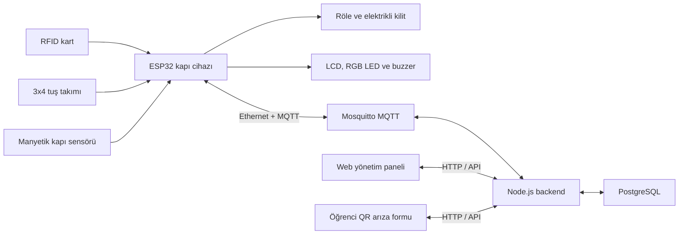

# SecureLab Erişim Kontrol Sistemi — Baştan Sona Proje Rehberi

> Bu belge, projeyi daha önce hiç görmemiş ve Docker, MQTT veya ESP32 hakkında çok az bilgisi olan bir kişinin sistemi anlayabilmesi, kurabilmesi, çalıştırabilmesi ve temel sorunları çözebilmesi için hazırlanmıştır.
>
> Belge güncel `main` dalındaki yazılıma göre hazırlanmıştır. Gerçek parolalar ve gizli anahtarlar özellikle yazılmamıştır.

## İçindekiler

1. [Proje ne yapıyor?](#1-proje-ne-yapıyor)
2. [Sistemin büyük resmi](#2-sistemin-büyük-resmi)
3. [Temel kavramlar](#3-temel-kavramlar)
4. [Proje klasörleri](#4-proje-klasörleri)
5. [Donanım listesi](#5-donanım-listesi)
6. [Donanım bağlantıları](#6-donanım-bağlantıları)
7. [Elektriksel güvenlik](#7-elektriksel-güvenlik)
8. [Bilgisayarda gerekli programlar](#8-bilgisayarda-gerekli-programlar)
9. [Projeyi indirme](#9-projeyi-indirme)
10. [Ortam ayarlarını hazırlama](#10-ortam-ayarlarını-hazırlama)
11. [Docker ile sistemi çalıştırma](#11-docker-ile-sistemi-çalıştırma)
12. [Web sitesini açma](#12-web-sitesini-açma)
13. [Gerçek sunucuya kurulum](#13-gerçek-sunucuya-kurulum)
14. [Web panelinin kullanımı](#14-web-panelinin-kullanımı)
15. [Kart okutma ve yetkilendirme akışı](#15-kart-okutma-ve-yetkilendirme-akışı)
16. [PIN ile giriş akışı](#16-pin-ile-giriş-akışı)
17. [Kapı, röle, sensör, LED ve buzzer davranışı](#17-kapı-röle-sensör-led-ve-buzzer-davranışı)
18. [MQTT iletişimi](#18-mqtt-iletişimi)
19. [ESP32 yazılımını hazırlama ve yükleme](#19-esp32-yazılımını-hazırlama-ve-yükleme)
20. [OTA ile uzaktan firmware güncelleme](#20-ota-ile-uzaktan-firmware-güncelleme)
21. [QR kodlu arıza bildirim sistemi](#21-qr-kodlu-arıza-bildirim-sistemi)
22. [Veritabanı ve başlangıç kayıtları](#22-veritabanı-ve-başlangıç-kayıtları)
23. [Günlük işletim ve bakım](#23-günlük-işletim-ve-bakım)
24. [GitHub güncelleme ve sunucuya yayınlama](#24-github-güncelleme-ve-sunucuya-yayınlama)
25. [Sorun giderme](#25-sorun-giderme)
26. [Üretim güvenliği](#26-üretim-güvenliği)
27. [Son kontrol listesi](#27-son-kontrol-listesi)
28. [Hızlı komut özeti](#28-hızlı-komut-özeti)

---

## 1. Proje ne yapıyor?

SecureLab, bir laboratuvar kapısını aşağıdaki yöntemlerle yöneten erişim kontrol sistemidir:

- RFID kart ile giriş
- Tuş takımından geçici PIN ile giriş
- Web panelinden uzaktan kapı açma
- Kapının açık veya kapalı olduğunu manyetik sensörle izleme
- Kapı uzun süre açık kalırsa buzzer ve LED ile uyarı verme
- Tüm giriş denemelerini veritabanına kaydetme
- Bilinmeyen kartı web paneline yetkilendirme isteği olarak gönderme
- Kullanıcı, kart ve erişim yetkilerini web panelinden yönetme
- Öğrencilerin QR kod üzerinden arıza bildirmesini sağlama
- ESP32 yazılımını ağ üzerinden OTA yöntemiyle güncelleme

Sistem yalnızca bir web sitesi değildir. Dört ana parçanın birlikte çalışması gerekir:

1. Kapıdaki ESP32 ve bağlı donanımlar
2. MQTT mesaj sunucusu
3. Backend ve PostgreSQL veritabanı
4. Kullanıcının açtığı web paneli

Bu parçalardan biri çalışmıyorsa sistemin bir bölümü çalışmayabilir. Örneğin web sitesi açık olsa bile MQTT kapalıysa ESP32 kart kararını sunucudan alamaz.

---

## 2. Sistemin büyük resmi



### Bir kart okutulduğunda kısa akış

1. RFID okuyucu kartın UID değerini ESP32'ye verir.
2. ESP32 bu UID'yi MQTT ile backend'e yollar.
3. Backend veritabanında kartı, kullanıcıyı, kapıyı ve varsa zaman kuralını kontrol eder.
4. Backend MQTT üzerinden `onay=true` veya `onay=false` cevabı yollar.
5. Onay varsa ESP32 röleyi 2 saniye tetikler.
6. Sonuç LCD, LED, buzzer ve giriş geçmişine yansır.

---

## 3. Temel kavramlar

| Kavram | Basit açıklama |
|---|---|
| ESP32 | Kapının yanında çalışan küçük kontrol bilgisayarıdır. |
| Backend | Karar veren sunucu yazılımıdır. Kullanıcıları, kartları ve kayıtları yönetir. |
| Frontend | Tarayıcıda gördüğümüz web panelidir. |
| PostgreSQL | Kullanıcıların, kartların ve geçmiş kayıtlarının tutulduğu veritabanıdır. |
| MQTT | ESP32 ile backend arasında küçük ve hızlı mesajlar taşıyan protokoldür. |
| Mosquitto | Projede kullanılan MQTT broker yazılımıdır. |
| Docker | Backend, veritabanı, MQTT ve web servislerini ayrı kutular içinde çalıştırır. |
| Docker Compose | Bütün Docker servislerini tek komutla başlatır. |
| UID | Her RFID karttan okunan benzersiz kimlik değeridir. Örnek: `3C:B2:24:07`. |
| PIN | Tuş takımından girilen geçici sayısal şifredir. |
| OTA | ESP32 yazılımını USB kablosu takmadan ağ üzerinden güncelleme yöntemidir. |
| DHCP | Ethernet ağı üzerinden ESP32'ye otomatik IP adresi verir. |
| NTP | İnternet/ağ üzerinden tarih ve saat alır. |
| RTC | İnternet kesilse bile piliyle saati koruyan DS3231 modülüdür. |

---

## 4. Proje klasörleri

```text
secure-door-project/
├── backend/                 Node.js API, MQTT servisi ve Prisma
│   ├── prisma/              Veritabanı şeması, migration ve seed
│   └── src/                 Backend kaynak kodu
├── frontend/                HTML, CSS ve JavaScript web paneli
│   └── assets/              Yeni arayüzün CSS/JS dosyaları
├── esp32-kodlar/            PlatformIO tabanlı ESP32 yazılımı
│   ├── include/             Başlık ve yapılandırma dosyaları
│   ├── src/                 ESP32 kaynak kodları
│   └── platformio.ini       Kart, kütüphane ve derleme ayarları
├── mosquitto/               MQTT broker ayarı
├── docs/                    Proje belgeleri
├── docker-compose.yml       Bütün sunucu servislerini tanımlar
├── .env.example             Ortam ayarları şablonu
└── .env                     Gerçek yerel ayarlar; GitHub'a gönderilmez
```

Önemli dosyalar:

- `docker-compose.yml`: hangi servislerin hangi portlarda çalışacağını belirler.
- `.env`: veritabanı parolası, JWT anahtarı ve benzeri sunucu ayarlarını tutar.
- `esp32-kodlar/include/config.local.h`: cihaza özel ESP32 ayarlarını tutar.
- `backend/prisma/schema.prisma`: veritabanı tablolarının ana tanımıdır.
- `esp32-kodlar/src/main.cpp`: cihazın ana çalışma döngüsüdür.

---

## 5. Donanım listesi

Mevcut yazılım aşağıdaki donanıma göre hazırlanmıştır:

- ESP32 Dev Module
- W5500 Lite Ethernet modülü
- MFRC522 RFID okuyucu
- 3x4 matris tuş takımı
- Röle modülü
- Elektrikli kilit
- Manyetik kapı sensörü (reed switch)
- Pasif buzzer
- Ortak anot/ortak artı RGB LED
- PCF8574T I2C port çoğaltıcı
- 16x2 I2C LCD ekran
- DS3231 RTC saat modülü
- Gerekli dirençler
- Kilit için uygun harici güç kaynağı
- Ortak GND bağlantısı

Donanımın modeline göre besleme gerilimi değişebilir. Modül üzerindeki etiketi veya üretici veri sayfasını kontrol etmeden 5 V ya da 12 V vermeyin.

---

## 6. Donanım bağlantıları

### 6.1 ESP32 pin özeti

| İşlev | ESP32 pini | Açıklama |
|---|---:|---|
| Röle kontrol | GPIO27 | Mevcut röle mantığına göre kontrol edilir. |
| Buzzer | GPIO14 | PWM ile ses üretilir. |
| Manyetik sensör | GPIO35 | Yalnız giriş pinidir; harici pull-up gerekir. |
| I2C SDA | GPIO21 | LCD, RTC ve PCF8574T ile paylaşılır. |
| I2C SCL | GPIO17 | LCD, RTC ve PCF8574T ile paylaşılır. |
| SPI SCK | GPIO18 | RFID ve W5500 tarafından paylaşılır. |
| SPI MISO | GPIO19 | RFID ve W5500 tarafından paylaşılır. |
| SPI MOSI | GPIO23 | RFID ve W5500 tarafından paylaşılır. |
| RFID CS/SDA/SS | GPIO5 | Yalnız MFRC522 seçme pinidir. |
| RFID RST | GPIO22 | MFRC522 reset pinidir. |
| W5500 CS | GPIO13 | Yalnız Ethernet modülünü seçer. |
| Keypad R1 | GPIO4 | Tuş takımı satır 1 |
| Keypad R2 | GPIO16 | Tuş takımı satır 2 |
| Keypad R3 | GPIO32 | Tuş takımı satır 3 |
| Keypad R4 | GPIO33 | Tuş takımı satır 4 |
| Keypad C1 | GPIO15 | Tuş takımı sütun 1 |
| Keypad C2 | GPIO12 | Tuş takımı sütun 2 |
| Keypad C3 | GPIO2 | Tuş takımı sütun 3 |

### 6.2 MFRC522 RFID bağlantısı

| MFRC522 | ESP32 |
|---|---|
| SDA / SS | GPIO5 |
| SCK | GPIO18 |
| MOSI | GPIO23 |
| MISO | GPIO19 |
| RST | GPIO22 |
| 3.3V | 3.3V |
| GND | GND |

MFRC522 doğrudan 3.3 V seviyesinde çalışır. Veri pinlerine 5 V uygulamayın.

### 6.3 W5500 Lite Ethernet bağlantısı

| W5500 Lite | ESP32 |
|---|---|
| SCK | GPIO18 |
| MISO | GPIO19 |
| MOSI | GPIO23 |
| CS | GPIO13 |
| RST | Bağlanmıyor |
| INT | Bağlanmıyor |
| VCC | Kullanılan modülün gerilim değerine göre; bu devrede 3.3 V kabul edilmiştir |
| GND | GND |

RFID ile Ethernet aynı SCK, MISO ve MOSI hatlarını paylaşır. Bu normaldir. İki modülün CS pinleri farklıdır:

- RFID CS: GPIO5
- W5500 CS: GPIO13

### 6.4 PCF8574T ve RGB LED bağlantısı

PCF8574T adres anahtarları:

| Anahtar | Durum |
|---|---|
| A0 | OFF |
| A1 | OFF |
| A2 | ON |

Bu seçim I2C adresini `0x24` yapar.

| PCF8574T pini | Kullanım |
|---|---|
| P0 | RGB kırmızı bacak |
| P3 | RGB yeşil bacak |
| P5 | RGB mavi bacak |
| SDA | ESP32 GPIO21 |
| SCL | ESP32 GPIO17 |
| GND | Ortak GND |

Kullanılan RGB LED ortak artı/common-anode tipidir. Ortak artı bacağı uygun beslemeye bağlanır. Her renk bacağında uygun seri direnç kullanılmalıdır. PCF8574 çıkışına LED'i dirençsiz bağlamayın.

### 6.5 LCD ve RTC bağlantısı

LCD ile RTC aynı I2C hattını paylaşır:

| Modül | SDA | SCL | Besleme | GND |
|---|---|---|---|---|
| 16x2 I2C LCD | GPIO21 | GPIO17 | Modüle uygun VCC | Ortak GND |
| DS3231 RTC | GPIO21 | GPIO17 | Modüle uygun VCC | Ortak GND |
| PCF8574T | GPIO21 | GPIO17 | Modüle uygun VCC | Ortak GND |

LCD'nin yaygın adresi `0x27`'dir. Kod, I2C hattında uygun LCD adresini tarar. PCF8574T RGB adresi olan `0x24`, LCD olarak seçilmez.

### 6.6 Manyetik sensör bağlantısı

GPIO35'in dahili pull-up direnci yoktur. Bu yüzden harici 10 kΩ direnç gerekir:

```text
3.3V ── 10 kΩ ──┬── GPIO35
                 │
                 └── sensörün 1. kablosu

GND  ─────────────── sensörün 2. kablosu
```

Burada sensörün bir kablosu GPIO35 ile aynı düğüme, diğer kablosu GND'ye gider. Sensöre üç kablo bağlanmaz.

Mevcut yazılım mantığı:

- GPIO35 LOW: kapı kapalı
- GPIO35 HIGH: kapı açık

### 6.7 Röle ve elektrikli kilit

ESP32 GPIO27 yalnız rölenin kontrol girişine bağlanır. Kilidin 12 V akımı ESP32 üzerinden geçirilmez.

Genel düzen:

```text
ESP32 GPIO27 ── röle IN
ESP32 GND ───── röle kontrol GND

12 V güç kaynağı ── röle COM/NO/NC kontakları ── elektrikli kilit
```

NO veya NC seçimi kilidin çalışma türüne bağlıdır:

- Fail-secure kilit: enerji verildiğinde açılır.
- Fail-safe kilit: enerji kesildiğinde açılır.

Mevcut kod GPIO27'yi `OUTPUT_OPEN_DRAIN` olarak kullanır, beklemede LOW tutar, onayda 2 saniye HIGH/serbest duruma geçirir. Bu davranış mevcut röle devresine göre hazırlanmıştır. Röle modülü değişirse yazılım mantığı da yeniden doğrulanmalıdır.

---

## 7. Elektriksel güvenlik

Bu bölüm atlanmamalıdır.

1. ESP32 pinlerine doğrudan 12 V bağlamayın.
2. ESP32 GPIO pinleri 3.3 V lojik seviyesindedir.
3. Kilit akımını ESP32'nin 5 V/VIN pininden beslemeyin.
4. Kilit için ayrı ve yeterli akım sağlayan güç kaynağı kullanın.
5. Röle kontrol devresinin gerektirdiği şekilde GND'leri ortaklayın.
6. Endüktif yük olan kilitte uygun diyot/koruma devresi kullanın.
7. Bağlantı değiştirirken enerjiyi kesin.
8. Multimetreyle VCC-GND gerilimini ölçmeden modül takmayın.
9. Bir GND pininin bozuk olduğundan şüpheleniyorsanız başka GND kullanılabilir; yine de kart üzerindeki hasar araştırılmalıdır.
10. USB ile yükleme sırasında boot pinlerine bağlı devrelerin ESP32 açılışını engellemediğini kontrol edin.

---

## 8. Bilgisayarda gerekli programlar

### 8.1 Web ve sunucu tarafı için

- Git
- Docker Desktop (Windows geliştirme bilgisayarı için)
- Ubuntu sunucuda Docker Engine ve Docker Compose v2 eklentisi
- Bir metin düzenleyici; önerilen Visual Studio Code

Resmî kurulum bağlantıları:

- Docker Desktop Windows: <https://docs.docker.com/desktop/setup/install/windows-install/>
- Docker Engine Ubuntu: <https://docs.docker.com/engine/install/ubuntu/>
- Docker Compose eklentisi: <https://docs.docker.com/compose/install/linux/>

Kurulum kontrolü:

```powershell
git --version
docker --version
docker compose version
```

### 8.2 ESP32 için

- Visual Studio Code
- VS Code içinden PlatformIO IDE eklentisi
- ESP32 kartının USB sürücüsü
- Veri aktarabilen USB kablosu

PlatformIO resmî rehberi:

<https://docs.platformio.org/en/latest/integration/ide/vscode.html>

---

## 9. Projeyi indirme

### Windows PowerShell

```powershell
Set-Location C:\Users\KULLANICI_ADI\Documents
git clone https://github.com/rumeysakolip/secure-door-project.git
Set-Location .\secure-door-project
```

### Ubuntu sunucu

```bash
cd /opt
sudo git clone https://github.com/rumeysakolip/secure-door-project.git
sudo chown -R "$USER":"$USER" /opt/secure-door-project
cd /opt/secure-door-project
```

Depo zaten varsa yeniden klonlamak yerine:

```bash
git pull origin main
```

Remote adı farklıysa önce kontrol edin:

```bash
git remote -v
```

---

## 10. Ortam ayarlarını hazırlama

Sunucu ayarları `.env` dosyasında tutulur. Şablondan kopyalanır.

### Windows

```powershell
Copy-Item .env.example .env
notepad .env
```

### Ubuntu

```bash
cp .env.example .env
nano .env
```

### Önemli `.env` alanları

| Değişken | Ne işe yarar? |
|---|---|
| `POSTGRES_USER` | Veritabanı kullanıcı adı |
| `POSTGRES_PASSWORD` | Güçlü veritabanı parolası |
| `POSTGRES_DB` | Veritabanı adı |
| `DATABASE_URL` | Backend'in PostgreSQL bağlantısı; Docker içinde host `db` olmalıdır |
| `BACKEND_PORT` | Backend'in dış portu; varsayılan 3000 |
| `NODE_ENV` | Yerelde `development`, canlıda `production` |
| `MQTT_BROKER_URL` | Docker içinde genellikle `mqtt://mqtt:1883` |
| `MQTT_USERNAME` | MQTT kullanıcı adı; mevcut demo broker anonimdir |
| `MQTT_PASSWORD` | MQTT parolası |
| `ESP32_SECRET_KEY` | Cihaza özel güvenlik anahtarı |
| `JWT_SECRET` | Web oturum tokenlarını imzalar |
| `PIN_HISTORY_ENCRYPTION_KEY` | PIN geçmişini şifreler |
| `SEED_ADMIN_EMAIL` | İlk yönetici hesabının e-postası |
| `SEED_ADMIN_PASSWORD` | İlk yönetici web parolası |
| `SEED_ADMIN_PIN` | İlk yönetici kapı PIN'i |
| `CORS_ORIGIN` | Web panelinin dış adresi |
| `PASSWORD_RESET_BASE_URL` | Parola sıfırlama sayfasının dış adresi |
| `PUBLIC_ISSUE_URL` | QR kodun açacağı öğrenci arıza sayfası |
| `FIRMWARE_PUBLIC_BASE_URL` | ESP32'nin OTA dosyasını indireceği backend adresi |
| `OTA_SIGNING_SECRET` | OTA indirme bağlantısını koruyan anahtar |

### Güçlü anahtar üretme

Ubuntu veya Node.js bulunan ortamda örnek:

```bash
node -e "console.log(require('crypto').randomBytes(48).toString('hex'))"
```

Bu komutu ayrı ayrı çalıştırıp `JWT_SECRET`, `PIN_HISTORY_ENCRYPTION_KEY`, `ESP32_SECRET_KEY` ve `OTA_SIGNING_SECRET` için farklı değerler kullanın.

### Canlı sunucu için örnek adres mantığı

Sunucu IP'si `SUNUCU_IP` ise:

```dotenv
NODE_ENV=production
CORS_ORIGIN=http://SUNUCU_IP:8080
PASSWORD_RESET_BASE_URL=http://SUNUCU_IP:8080/sifre-sifirla.html
PUBLIC_ISSUE_URL=http://SUNUCU_IP:8080/ogrenci-ariza
FIRMWARE_PUBLIC_BASE_URL=http://SUNUCU_IP:3000
```

Alan adı ve HTTPS kurulduğunda IP yerine alan adı kullanılmalıdır.

`.env` dosyasını GitHub'a göndermeyin.

---

## 11. Docker ile sistemi çalıştırma

Komutları mutlaka `docker-compose.yml` dosyasının bulunduğu proje kökünde çalıştırın.

### Windows proje yolu örneği

```powershell
Set-Location C:\Users\besna\Documents\secure-door-project
```

CMD kullanılıyorsa:

```bat
cd /d C:\Users\besna\Documents\secure-door-project
```

### İlk başlatma

```powershell
docker compose up -d --build
```

Bu komut şunları başlatır:

| Servis | Görev | Dış port |
|---|---|---:|
| `db` | PostgreSQL veritabanı | 5432 |
| `mqtt` | Mosquitto MQTT | 1883 ve 9001 |
| `backend` | Node.js API | 3000 |
| `frontend` | Nginx web paneli | 8080 |
| `public-form` | Yalnız arıza formu için iç Nginx | Doğrudan dış port yok |
| `qr-tunnel` | Arıza formu için Cloudflare hızlı tüneli | Oluşan URL üzerinden |

Backend ilk açılışta otomatik olarak:

1. Prisma migrationlarını uygular.
2. Başlangıç verilerini ekler veya kontrol eder.
3. Backend servisini başlatır.

### Durumu kontrol etme

```powershell
docker compose ps
```

`frontend`, `backend`, `db`, `mqtt` servislerinin `running` veya `healthy` olması beklenir.

### Logları görme

```powershell
docker compose logs -f
```

Sadece backend:

```powershell
docker compose logs -f backend
```

Sadece MQTT:

```powershell
docker compose logs -f mqtt
```

### Durdurma ve yeniden başlatma

```powershell
docker compose stop
docker compose start
```

Yapılandırma değiştiyse:

```powershell
docker compose up -d --build
```

Normal kapatma:

```powershell
docker compose down
```

`docker compose down -v` komutu veritabanı volume'unu da siler. Bütün kayıtları kaybetmek istemiyorsanız `-v` kullanmayın.

---

## 12. Web sitesini açma

### Aynı bilgisayarda çalışıyorsa

```text
http://localhost:8080/login.html
```

### Başka bir bilgisayarda çalışıyorsa

Docker hangi bilgisayarda çalışıyorsa o bilgisayarın IPv4 adresi kullanılmalıdır:

```text
http://DIGER_BILGISAYARIN_IP_ADRESI:8080/login.html
```

Windows'ta IP öğrenme:

```powershell
ipconfig
```

Ubuntu'da IP öğrenme:

```bash
ip -br addr
```

### Gerçek sunucuda çalışıyorsa

```text
http://SUNUCU_IP:8080/login.html
```

GitHub'a kod göndermek web sitesini otomatik olarak çalıştırmaz. Projede şu anda otomatik GitHub Actions deployment dosyası yoktur. Sunucuda ayrıca `git pull` ve `docker compose up -d --build` çalıştırılmalıdır.

### Erişim testi

Windows istemciden:

```powershell
Test-NetConnection SUNUCU_IP -Port 8080
```

`TcpTestSucceeded : True` beklenir.

False ise olası nedenler:

- Docker servisleri çalışmıyor.
- Port 8080 sunucu güvenlik duvarında kapalı.
- İstemci ile sunucu farklı VLAN/ağlarda ve yönlendirme yok.
- Yanlış IP kullanılıyor.
- Web yalnız `localhost` üzerinde çalıştırılmış.

---

## 13. Gerçek sunucuya kurulum

Önerilen temel sunucu:

- Ubuntu Server 22.04 LTS veya 24.04 LTS
- En az 2 vCPU
- En az 4 GB RAM
- En az 40–50 GB SSD
- Statik IP veya sabit DNS adı
- Docker Engine ve Docker Compose v2

### 13.1 Sunucuya bağlanma

```powershell
ssh SUNUCU_KULLANICISI@SUNUCU_IP
```

Port 22 erişilemiyorsa kodla düzeltilemez. Sunucu konsolundan SSH servisi ve ağ güvenlik kuralları kontrol edilmelidir.

### 13.2 Projeyi kurma

```bash
cd /opt
sudo git clone https://github.com/rumeysakolip/secure-door-project.git
sudo chown -R "$USER":"$USER" /opt/secure-door-project
cd /opt/secure-door-project
cp .env.example .env
nano .env
docker compose up -d --build
docker compose ps
```

### 13.3 Sunucunun kendi içinde test

```bash
curl http://127.0.0.1:3000/api/health
curl -I http://127.0.0.1:8080/login.html
```

Bu testler başarılı, dış bilgisayardan erişim başarısızsa sorun büyük olasılıkla firewall veya ağ yönlendirmesidir.

### 13.4 Demo için gerekli portlar

- TCP 22: SSH yönetimi
- TCP 8080: mevcut web paneli
- TCP 3000: ESP32 OTA dosyasını doğrudan backend'den indirecekse
- TCP 1883: ESP32 MQTT bağlantısı

### 13.5 Üretim için önerilen portlar

- TCP 22: yalnız yönetim ağı/VPN üzerinden
- TCP 80: HTTPS'e yönlendirme
- TCP 443: web paneli
- MQTT için tercihen TLS'li 8883

Mevcut W5500 firmware'i MQTT `1883` ve OTA HTTP kullanır. TLS/HTTPS'e geçmeden önce ESP32 Ethernet istemcisinde sertifika doğrulama desteği ayrıca geliştirilmelidir.

PostgreSQL 5432 portu canlı ortamda dış dünyaya açılmamalıdır. Mevcut Compose dosyasında host portu vardır; üretime geçerken bu eşleme kaldırılmalı veya firewall ile yalnız sunucu içinde tutulmalıdır.

---

## 14. Web panelinin kullanımı

### 14.1 Giriş

İlk yönetici hesabı `.env` içindeki şu değerlerden oluşturulur:

- `SEED_ADMIN_EMAIL`
- `SEED_ADMIN_PASSWORD`
- `SEED_ADMIN_PIN`

Web girişinde e-posta ve web parolası kullanılır. Web parolası ile kapı PIN'i aynı şey değildir.

### 14.2 Roller

| Rol | Genel yetki |
|---|---|
| `admin` | Kullanıcı yönetimi, kart yetkilendirme, uzaktan kapı açma, arıza durumunu değiştirme ve bütün yönetim işlemleri |
| `hoca` | Panel, giriş geçmişi, kendi PIN işlemleri ve izin verilen görüntüleme işlemleri |
| `sistem` | Sistem içi kayıtlar için ayrılmış rol |

Seed işlemi yalnız `.env` ile tanımlanan tek yönetici hesabını korur. Başka admin kayıtları varsa onları `hoca` rolüne indirir.

### 14.3 Sayfalar

| Sayfa | Görev |
|---|---|
| `index.html` | Genel panel ve sistem özeti |
| `admin.html` | Kullanıcı yönetimi; yalnız admin |
| `yetkilendirme.html` | Bekleyen kartları kullanıcıya atama ve kart yetkilerini açıp kapatma |
| `gecmis-girisler.html` | Kart/PIN giriş geçmişi |
| `gecici-sifre.html` | Kullanıcının kendisi veya admin tarafından yeni PIN üretme |
| `ariza-gecmisi.html` | Arıza bildirimlerini görüntüleme ve yönetme |
| `qr-kod.html` | Öğrenci arıza formunun QR kodu |
| `hesabim.html` | Hesap bilgileri ve web parolası işlemleri |
| `ariza-bildir.html` | Giriş gerektirmeyen öğrenci arıza formu |

### 14.4 Akademik personeli veritabanına ekleme

Projede hazır akademik personel içe aktarma betiği vardır:

```powershell
docker compose exec backend npm run import:academic-staff
```

Bu işlem kayıtları `hoca` rolüyle ekler veya günceller. Bu kullanıcıların kart atama listesinde görünmesini sağlar. Betik yeni kullanıcıya otomatik web parolası vermediği için web girişi gerekiyorsa ayrıca parola tanımlanmalıdır.

---

## 15. Kart okutma ve yetkilendirme akışı

### 15.1 Yeni/bilinmeyen kart

1. Kart MFRC522'ye okutulur.
2. ESP32 UID'yi MQTT ile gönderir.
3. Backend kartı veritabanında bulamaz.
4. Kart `onay_bekliyor` durumuyla kaydedilir.
5. İlk okuma güvenlik gereği reddedilir ve kapı açılmaz.
6. Yönetici `Yetkilendirme` sayfasını açar.
7. Bekleyen kartın yanında kullanıcı seçilir.
8. `Onayla` düğmesine basılır.
9. Kart ve kart-yetkilendirme kaydı aktif olur.
10. Kart tekrar okutulduğunda backend onay verir ve kapı açılır.

Yetkilendirme sayfası açıkken son okutulan kart alanı yaklaşık 2 saniyede bir yenilenir. Bekleyen liste o anda yenilenmiyorsa sayfayı yenileyin.

### 15.2 Kartı reddetme

`Reddet` seçilirse kart `iptal` durumuna alınır ve varsa yetkisi pasif olur. Aynı kart daha sonra tekrar okutulursa yeniden bekleyen istek olarak oluşturulabilir.

### 15.3 Yetkili kartın açmama nedenleri

- Kart kaydı aktif değil.
- Kart-yetkilendirme kaydı pasif.
- Kullanıcı pasif.
- Cihaz ile kapı arasında aktif atama yok.
- Kapı kaydı aktif değil.
- Zaman/yetki kuralı kullanıcıya izin vermiyor.
- MQTT bağlantısı yok.
- Cevap 6 saniye içinde ESP32'ye ulaşmadı.
- Kapı sensörü kapının zaten açık olduğunu bildiriyor.

### 15.4 İnternet/MQTT yokken kart

Mevcut güvenlik politikasında kartlar çevrimdışı açılmaz. Kart doğrulaması için MQTT ve backend gereklidir.

---

## 16. PIN ile giriş akışı

### 16.1 Yeni PIN üretme

1. Web panelinde `Geçici Şifre` sayfası açılır.
2. Kullanıcı kendisi için veya admin seçilen kullanıcı için PIN üretir.
3. Backend 6 haneli rastgele PIN oluşturur.
4. PIN hash olarak veritabanına kaydedilir.
5. PIN 24 saat geçerli olacak şekilde işaretlenir.
6. Uygun cihazlara MQTT ile çevrimdışı PIN listesi gönderilir.
7. Düz PIN ekranda bir kez gösterilir; kullanıcı not almalıdır.

### 16.2 Kapıda PIN girme

1. Sayısal tuşlarla PIN yazılır.
2. Her tuşta kısa buzzer sesi duyulur.
3. PIN'i göndermek için `#` tuşuna basılır.
4. `*` tuşu girilen PIN'i temizler.
5. 15 saniye işlem yapılmazsa giriş zaman aşımına uğrar.
6. PIN uzunluğu 4–6 hane olmalıdır; web tarafından üretilen PIN 6 hanedir.
7. ESP32 PIN'i MQTT ile backend'e gönderir.
8. Onay gelirse röle tetiklenir.

PIN, son rakam yazıldığı anda gönderilmez; mutlaka `#` kullanılmalıdır.

### 16.3 İnternet/MQTT yokken PIN

Yalnız daha önce sunucu tarafından ESP32'nin kalıcı hafızasına aktarılmış PIN'ler çevrimdışı çalışabilir.

- Düz PIN ESP32'de saklanmaz; cihaza özel salt ile SHA-256 özeti saklanır.
- Daha önce hiç senkronize edilmemiş PIN internet yokken çalışmaz.
- Çevrimdışı olaylar LittleFS kuyruğuna alınır ve bağlantı dönünce gönderilir.
- Kartlar çevrimdışı çalışmaz.

---

## 17. Kapı, röle, sensör, LED ve buzzer davranışı

### 17.1 Röle

- Bekleme: GPIO27 pasif/LOW
- Onay: GPIO27 2 saniye aktif/HIGH-serbest
- Ardından: tekrar pasif/LOW
- Yeni tetiklemeden önce 1 saniye soğuma süresi vardır.
- Sensör kapının zaten açık olduğunu bildiriyorsa röle tekrar tetiklenmez.

### 17.2 Manyetik sensör

- LOW: kapalı
- HIGH: açık
- Değişim 500 ms debounce işleminden sonra kabul edilir.
- Başlangıçtaki gerçek durum hemen terminale ve MQTT'ye yazılır.

### 17.3 Kapı açık alarmı

Kapı 20 saniyeden uzun açık kalırsa:

- Buzzer tekrarlı uyarı verir.
- Alarm LED deseni çalışır.
- LCD alarm gösterir.
- Kapı kapanınca alarm otomatik durur.

### 17.4 RGB LED

Mevcut genel davranış:

- Normal bekleme: LED yanmaz.
- PIN yazılırken: mavi.
- Doğru kart/PIN: yeşil.
- Yanlış kart/PIN: kırmızı.
- Kapı açık alarmı: alarm deseni.

RGB LED PCF8574T üzerinde P0/P3/P5 ile ve aktif-düşük ortak anot mantığıyla sürülür.

### 17.5 Buzzer

- Tuşa basma: tek çok kısa ses
- Onay: kısa başarı sesi
- Red: üçlü belirgin hata sesi
- Kapı uzun süre açık: yüksek frekanslı tekrarlı alarm

Kod pasif buzzer için PWM üretir. Aktif buzzer takılırsa ses davranışı farklı olabilir.

### 17.6 LCD

LCD'de aşağıdaki durumlar gösterilir:

- Sistem başlatılıyor
- Ethernet bağlanıyor/bağlı/değil
- MQTT bekleniyor/bağlandı/koptu
- Kart veya PIN kontrol ediliyor
- Onaylandı
- Reddedildi
- Bağlantı yok
- Kapı açık/kapalı
- Kapı alarmı

### 17.7 RTC ve saat

- Ethernet varsa NTP üzerinden saat alınır.
- NTP başarıyla alınırsa DS3231 RTC güncellenir.
- Ağ kesilirse geçerli RTC zamanı kullanılmaya devam eder.
- RTC yoksa sistem çalışır; ancak ağ yokken zaman damgası güvenilir olmayabilir.

---

## 18. MQTT iletişimi

ESP32 ve backend doğrudan HTTP ile kart doğrulaması yapmaz. Ana cihaz iletişimi MQTT'dir.

### 18.1 Cihazdan backend'e

| Topic | İçerik |
|---|---|
| `kapi/<cihazId>/erisim-istek` | Kart UID veya PIN doğrulama isteği |
| `kapi/<cihazId>/saglik` | Her 30 saniyede cihaz, Ethernet IP ve firmware durumu |
| `kapi/<cihazId>/durum` | Kapı açık/kapalı ve komut sonucu |
| `kapi/<cihazId>/ota-durum` | OTA başlangıç, ilerleme, başarı veya hata |

### 18.2 Backend'den cihaza

| Topic | Komut |
|---|---|
| `kapi/<cihazId>/erisim-yanit` | Kart/PIN onay veya red kararı |
| `kapi/<cihazId>/kapi-ac` | Web panelinden uzaktan açma |
| `kapi/<cihazId>/sifre-guncelleme` | Çevrimdışı PIN listesini güncelleme |
| `kapi/<cihazId>/firmware-guncelle` | OTA firmware güncelleme komutu |

ESP32 `kapi/<cihazId>/+` desenine abone olur.

### 18.3 MQTT bağlantı hataları

ESP32 terminalinde:

```text
[MqttManager] Broker'a baglaniliyor... Basarisiz, rc=-2
```

genellikle broker IP/portuna TCP bağlantısının kurulamadığı anlamına gelir.

Kontrol sırası:

1. ESP32 Ethernet'ten IP aldı mı?
2. RJ45 link ışığı yanıyor mu?
3. `MQTT_BROKER_HOST` doğru mu?
4. Broker'ın 1883 portu açık mı?
5. Mosquitto container çalışıyor mu?
6. ESP32 ağı ile sunucu ağı arasında yönlendirme var mı?
7. Firewall 1883 portunu engelliyor mu?

Windows testi:

```powershell
Test-NetConnection MQTT_SUNUCU_IP -Port 1883
```

---

## 19. ESP32 yazılımını hazırlama ve yükleme

### 19.1 Yerel config oluşturma

`config.local.h` GitHub'a gönderilmez. Örnekten oluşturun:

```powershell
Copy-Item esp32-kodlar\include\config.local.example.h esp32-kodlar\include\config.local.h
```

Kontrol edilecek ana değerler:

```cpp
#define MQTT_BROKER_HOST "SUNUCU_IP"
#define MQTT_BROKER_PORT 1883
#define DEVICE_ID 1
#define DOOR_ID 1
#define NETWORK_USE_ETHERNET 1
#define ETHERNET_CS_PIN 13
#define ETHERNET_RST_PIN -1
#define ETHERNET_INT_PIN -1
```

Ethernet kullanıldığında Wi-Fi alanları derlemede bulunabilir ancak aktif ağ bağlantısı W5500 üzerinden kurulur.

### 19.2 Derleme

VS Code içinde `esp32-kodlar` klasörünü PlatformIO projesi olarak açın.

Terminalden:

```powershell
Set-Location .\esp32-kodlar
platformio run --environment esp32dev
```

Başarılı sonuçta `SUCCESS` görülür.

### 19.3 USB ile yükleme

```powershell
platformio run --target upload --environment esp32dev
```

Birden fazla COM port varsa `platformio.ini` içine geçici olarak eklenebilir:

```ini
upload_port = COM3
monitor_port = COM3
```

### 19.4 Serial Monitor

```powershell
platformio device monitor --baud 115200
```

Monitor açıkken upload yapılamaz. Önce monitorü `Ctrl+C` ile kapatın.

### 19.5 Beklenen açılış mesajları

Başarılı sistemde buna benzer mesajlar görülür:

```text
[SYSTEM] SecureDoor baslatiliyor...
[LCD] 16x2 I2C LCD hazir...
[RTC] DS3231 bulundu...
[CardReader] MFRC522 hazir...
[Ethernet] IP alindi: ...
[MqttManager] Broker'a baglaniliyor... Baglandi!
[SYSTEM] Hazir.
```

### 19.6 MAC adresi

W5500 için MAC adresi ESP32'nin benzersiz eFuse kimliğinden üretilir. İlk byte yerel yönetilen adresi göstermek için `02` olur. Üniversite ağında MAC kaydı gerekiyorsa Serial Monitor'da gösterilen/hesaplanan Ethernet MAC adresi ağ yönetimine kaydettirilmelidir.

---

## 20. OTA ile uzaktan firmware güncelleme

OTA desteğini içeren firmware cihaza ilk kez USB ile yüklenmiş olmalıdır.

### 20.1 Yeni firmware oluşturma

`FIRMWARE_VERSION` değerini artırın ve derleyin:

```powershell
Set-Location esp32-kodlar
platformio run --environment esp32dev
```

Oluşan dosya:

```text
esp32-kodlar/.pio/build/esp32dev/firmware.bin
```

### 20.2 Firmware'i backend'e yükleme

Yükleme admin kimlik doğrulaması gerektirir. Ayrıntılı API örneği için `docs/ota-guncelleme.md` dosyasına bakın.

Backend dosya için boyut, MD5 ve SHA-256 üretir ve `backend/firmware` altında saklar.

### 20.3 Cihaza güncelleme komutu

Backend şu MQTT topic'ine komut yollar:

```text
kapi/<cihazId>/firmware-guncelle
```

ESP32 güncellemeyi yalnız güvenli durumda başlatır:

- Ethernet bağlı
- MQTT bağlı
- Kapı kapalı
- Sistem bekleme durumunda
- Kart/PIN kararı beklenmiyor
- Kapı açık alarmı yok
- Firmware ESP32 OTA bölümüne sığıyor
- Boyut ve MD5 değerleri geçerli

Firmware HTTP üzerinden W5500 ile indirilir, flash'a yazılır ve ESP32 yeniden başlar.

### 20.4 OTA güvenlik notu

Mevcut Ethernet OTA indirmesi HTTP ve MD5 kontrolü kullanır. MD5 aktarım hatasını tespit eder ancak güçlü imza doğrulamasının yerini tutmaz. Üretimde ağ izolasyonu ve daha sonra imzalı firmware/HTTPS desteği önerilir.

---

## 21. QR kodlu arıza bildirim sistemi

Öğrenci yönetim paneline giriş yapmadan arıza bildirebilir.

Form adresi:

```text
http://SUNUCU_IP:8080/ogrenci-ariza
```

Formda:

- Ad soyad
- `@subu.edu.tr` uzantılı e-posta kullanıcı adı
- Arıza türü
- Fotoğraf
- 5–512 karakter açıklama

istenir. Fotoğraf için tarayıcı tarafındaki sınır 2.5 MB'dir.

Gönderilen kayıt veritabanında `OPEN` durumuyla oluşturulur. Yönetici arıza geçmişi sayfasından durumu güncelleyebilir.

### Kalıcı QR için

`.env` içinde:

```dotenv
PUBLIC_ISSUE_URL=https://ALAN_ADI/ogrenci-ariza
```

gibi telefonların erişebileceği bir adres kullanılmalıdır. `localhost` yalnız aynı cihazda çalışır ve telefon QR kodunda kullanılamaz.

Compose içindeki `qr-tunnel` hızlı Cloudflare tüneli geçici bir URL üretebilir. Kalıcı üretim kullanımı için alan adıyla yönetilen sabit tünel veya normal HTTPS reverse proxy tercih edilmelidir.

---

## 22. Veritabanı ve başlangıç kayıtları

Prisma şeması temel olarak şunları saklar:

- Birimler
- Kullanıcılar
- Web parola ve PIN bilgileri
- PIN geçmişi
- Kartlar
- Kart-kullanıcı yetkilendirmeleri
- Kapılar
- ESP32 cihazları
- Cihaz-kapı atamaları
- Cihaz durumları
- Giriş kayıtları
- Arıza bildirimleri
- Gruplar ve yetki kuralları
- Denetim kayıtları
- Çevrimdışı liste sürümleri

İlk başlatmada seed işlemi:

1. Bilgisayar Mühendisliği birimini oluşturur.
2. `.env` ile belirtilen yönetici hesabını oluşturur/günceller.
3. Diğer admin hesaplarını hoca rolüne çevirir.
4. Laboratuvar kapısını oluşturur.
5. `ESP32-LAB-001` cihazını oluşturur.
6. Cihazı laboratuvar kapısına atar.
7. İlk cihaz durum kaydını oluşturur.

### Veritabanı yedeği

Değerleri kendi `.env` ayarlarınıza göre değiştirin:

```bash
docker compose exec -T db pg_dump -U VERITABANI_KULLANICISI VERITABANI_ADI > securelab-backup.sql
```

Yedek dosyasını güvenli bir yerde saklayın.

---

## 23. Günlük işletim ve bakım

### Her gün kontrol edilebilecekler

- Web paneli açılıyor mu?
- `docker compose ps` servisleri healthy mi?
- ESP32 Serial Monitor'da Ethernet ve MQTT bağlı mı?
- Panelde cihaz çevrimiçi görünüyor mu?
- Kapı sensörü açık/kapalı durumunu doğru gösteriyor mu?
- Son kart ve PIN denemeleri giriş geçmişine düşüyor mu?
- Bekleyen arıza ve kart istekleri var mı?

### Haftalık/aylık kontroller

- Veritabanı yedeği alın.
- Docker loglarında sürekli hata var mı bakın.
- Disk doluluğunu kontrol edin.
- Varsayılan parolaların kullanılmadığını doğrulayın.
- Kullanılmayan kullanıcı ve kartları pasifleştirin.
- RTC pilini ve saat doğruluğunu kontrol edin.
- Kilit ve sensör kablolarında gevşeme olup olmadığını kontrol edin.

### Log komutları

```bash
docker compose logs --tail=200 backend
docker compose logs --tail=200 mqtt
docker compose logs --tail=200 frontend
```

---

## 24. GitHub güncelleme ve sunucuya yayınlama

### Geliştirme bilgisayarında

```powershell
git status
git add DOSYALAR
git commit -m "Yapılan değişikliğin kısa açıklaması"
git pull --rebase upstream main
git push upstream main
```

Gerçek şifre içeren dosyaları eklemeyin:

- `.env`
- `esp32-kodlar/include/config.local.h`
- SSH anahtarları
- Veritabanı yedekleri

### Sunucuda yeni sürümü yayınlama

GitHub güncellemesinden sonra sunucuda ayrıca:

```bash
cd /opt/secure-door-project
git pull origin main
docker compose up -d --build
docker compose ps
```

çalıştırılır.

Önemli ayrım:

```text
git push  = kodu GitHub'a gönderir
git pull  = GitHub'daki kodu sunucuya çeker
docker compose up -d --build = yeni kodu gerçekten çalıştırır
```

---

## 25. Sorun giderme

### 25.1 Web sitesi açılmıyor

Kontrol:

```powershell
docker compose ps
docker compose logs --tail=100 frontend
docker compose logs --tail=100 backend
Test-NetConnection SUNUCU_IP -Port 8080
```

| Belirti | Muhtemel neden | Çözüm |
|---|---|---|
| `ERR_CONNECTION_REFUSED` | Portta servis yok | Docker servislerini başlatın. |
| Sayfa sürekli yükleniyor | Ağ rotası/firewall | 8080 portunu ve VLAN yönlendirmesini kontrol edin. |
| `localhost` açılıyor, başka PC açamıyor | Host firewall | Docker çalışan PC'de TCP 8080 girişine izin verin. |
| Login sayfası var, API yok | Backend unhealthy | Backend ve DB loglarını kontrol edin. |

Windows'ta Linux komutu olan `ip` yerine `ipconfig` kullanılır.

### 25.2 Docker “configuration file not found”

Yanlış klasördesiniz. Önce:

```bat
cd /d C:\Users\besna\Documents\secure-door-project
```

Sonra Docker komutunu çalıştırın.

### 25.3 ESP32 upload olmuyor

Belirtiler:

```text
Failed to connect to ESP32: No serial data received
```

Kontrol sırası:

1. Serial Monitor'ü kapatın.
2. Doğru COM portunu seçin.
3. Veri kablosu kullanın.
4. Upload başlarken BOOT tuşuna basılı tutun.
5. `Connecting...` geçince BOOT'u bırakın.
6. Gerekirse EN/RESET tuşuna bir kez basın.
7. Boot pinlerini etkileyen çevre donanımını geçici çıkarın.
8. Başka USB portu/kablo deneyin.

`invalid header: 0xffffffff` görülürse flash boş veya yarım yazılmış olabilir. Donanımları ayırıp firmware'i yeniden tam yükleyin.

### 25.4 COM portu erişim reddedildi

```text
PermissionError(13, Access denied)
```

Aynı COM portunu başka Serial Monitor veya program kullanıyordur. Bütün monitorleri kapatın, USB'yi çıkarıp takın ve tekrar deneyin.

### 25.5 W5500 IP almıyor

Beklenen mesaj:

```text
[Ethernet] IP alindi: ...
```

Alınmıyorsa:

- RJ45 kablo ve switch portu
- W5500 beslemesi
- SCK18/MISO19/MOSI23
- CS13
- GND ortaklığı
- Ağdaki DHCP servisi
- Üniversite ağındaki MAC kaydı

kontrol edilir.

### 25.6 MQTT bağlanmıyor

- Broker host ve port doğru mu?
- Sunucuya `Test-NetConnection IP -Port 1883` başarılı mı?
- `docker compose ps` içinde MQTT çalışıyor mu?
- Mosquitto 1883 dinliyor mu?
- ESP32 ile sunucu farklı ağlardaysa ağ erişimi izinli mi?

### 25.7 RFID `VersionReg=0x00` veya `0xFF`

- `0x00`: genellikle besleme veya iletişim yok.
- `0xFF`: MISO hattı boşta/yüksek, CS yanlış veya cihaz seçilemiyor olabilir.

Kontrol:

- 3.3 V ve GND
- SS/CS GPIO5
- RST GPIO22
- SPI GPIO18/19/23
- W5500 CS GPIO13'ün ayrı olması
- Kısa ve sağlam jumper kablolar

### 25.8 LCD görünmüyor

- LCD VCC/GND doğru mu?
- SDA21/SCL17 doğru mu?
- Kontrast potansiyometresi ayarlı mı?
- I2C adresi genellikle `0x27`; farklıysa tarama loguna bakın.
- Logic level dönüştürücü kullanılıyorsa HV/LV ve ortak GND doğru mu?

### 25.9 RTC bulunamadı

- VCC ve GND
- SDA21/SCL17
- RTC pili
- I2C adres çakışması

RTC olmasa da sistem çalışır; ağ kesildiğinde doğru saat korunamayabilir.

### 25.10 Röle tıklamıyor veya kilit açılmıyor

Önce iki sorunu ayırın:

1. Röle kontrol tarafı tıklıyor mu?
2. Röle kontağında kilit gerilimi gerçekten değişiyor mu?

Kontrol:

- GPIO27 ile röle IN
- Kontrol GND ortak mı?
- Röle modülü 3.3 V lojikle uyumlu mu?
- Röle modülünün kendi beslemesi doğru mu?
- 12 V yalnız kilit/kontak tarafında mı?
- NO/NC doğru seçilmiş mi?
- Serial Monitor'da `GPIO27 AKTIF` mesajı geliyor mu?

12 V bağlandığında röle kontrol ışığı sönmüyor veya röle çalışmıyorsa güç kaynağı, ortak GND, optokuplör/JD-VCC bağlantısı veya röle kartının tetik seviyesi kontrol edilmelidir. ESP32 GPIO'suna 12 V bağlanmamalıdır.

### 25.11 Sensör ters gösteriyor

Mevcut kod LOW=kapalı, HIGH=açık kabul eder. Kapı kapalıyken multimetreyle/sayısal okumayla GPIO35 seviyesini kontrol edin. Sensör tipi veya mıknatıs konumu ters mantık üretiyorsa kablolama ya da `DOOR_SENSOR_CLOSED_LEVEL` değeri uyarlanmalıdır.

### 25.12 Kart yetki verildiği halde reddediliyor

- Kart UID birebir aynı mı?
- Kart `aktif` mi?
- Kart-yetkilendirme `aktif` mi?
- Kullanıcı `aktif` mi?
- Cihaz ID ve kapı ID veritabanındaki atamayla aynı mı?
- MQTT cevap isteğin `cihaz_olay_id` değeriyle eşleşiyor mu?
- Kapı veya zaman kuralı kullanıcıya izin veriyor mu?

Backend logu kararın red nedenini gösterir.

### 25.13 PIN doğru olduğu halde reddediliyor

- PIN'in süresi dolmuş olabilir.
- `#` tuşuna basılmamış olabilir.
- Cihaz MQTT'ye bağlı olmayabilir.
- Çevrimdışı listede bu PIN bulunmayabilir.
- Kullanıcı veya kapı yetkisi pasif olabilir.

---

## 26. Üretim güvenliği

Canlı kullanımdan önce:

- Varsayılan bütün parolaları değiştirin.
- `.env` ve `config.local.h` dosyalarını GitHub'a göndermeyin.
- Mosquitto anonim erişimini kapatın.
- MQTT kullanıcı/parola ve mümkünse TLS kullanın.
- Web panelini HTTPS arkasında yayınlayın.
- PostgreSQL 5432 portunu dış dünyaya kapatın.
- Backend 3000 portunu yalnız gerekli iç ağlara açın.
- SSH erişimini anahtar ve VPN/yönetim ağıyla sınırlandırın.
- Düzenli veritabanı yedeği alın.
- OTA için imzalı firmware veya HTTPS sertifika doğrulaması ekleyin.
- Admin hesabını yalnız yetkili bir kişide tutun.
- Loglarda PIN, parola veya gizli anahtar yazdırmayın.
- Güç kesintisine karşı sunucu ve ağ cihazlarında UPS değerlendirin.

Mevcut `mosquitto.conf` demo amacıyla anonim MQTT'ye izin verir. Bu ayar internetten erişilebilir üretim ortamında güvenli değildir.

---

## 27. Son kontrol listesi

### Sunucu

- [ ] `.env` oluşturuldu ve güçlü anahtarlar yazıldı.
- [ ] Docker servisleri çalışıyor.
- [ ] Backend health endpoint başarılı.
- [ ] Web paneli sunucunun kendi içinde açılıyor.
- [ ] İstemci bilgisayardan web portuna TCP erişimi var.
- [ ] MQTT portuna ESP32 ağından erişim var.
- [ ] Veritabanı dış dünyaya kapalı.

### ESP32

- [ ] W5500 Ethernet'ten IP aldı.
- [ ] Doğru MAC ağ sistemine kaydedildi.
- [ ] MQTT bağlandı.
- [ ] MFRC522 bulundu.
- [ ] LCD bulundu.
- [ ] RTC bulundu veya yokluğu biliniyor.
- [ ] PCF8574T `0x24` adresinde bulundu.
- [ ] Sensör açık/kapalı doğru gösteriyor.
- [ ] Röle yalnız onayda 2 saniye tetikleniyor.
- [ ] Buzzer ve LED desenleri doğru.

### Fonksiyon testi

- [ ] Bilinmeyen kart bekleyen istek oluyor.
- [ ] Admin kartı kullanıcıya atayabiliyor.
- [ ] Yetkili kart ikinci okumada kapıyı açıyor.
- [ ] Yetkisiz kart kapıyı açmıyor.
- [ ] PIN `#` ile gönderiliyor.
- [ ] Doğru PIN kapıyı açıyor.
- [ ] Yanlış PIN reddediliyor.
- [ ] Kapı 20 saniye açık kalınca alarm veriyor.
- [ ] Kapı kapanınca alarm duruyor.
- [ ] Giriş geçmişi web paneline düşüyor.
- [ ] QR arıza formu telefondan açılıyor.
- [ ] Arıza kaydı yönetim panelinde görünüyor.
- [ ] OTA test cihazında başarıyla tamamlanıyor.

---

## 28. Hızlı komut özeti

### Windows'ta proje klasörüne git

```bat
cd /d C:\Users\besna\Documents\secure-door-project
```

### Sistemi başlat

```powershell
docker compose up -d --build
```

### Durumu gör

```powershell
docker compose ps
```

### Logları izle

```powershell
docker compose logs -f
```

### Web'i aç

```text
http://localhost:8080/login.html
http://SUNUCU_IP:8080/login.html
```

### Backend sağlık testi

```text
http://SUNUCU_IP:3000/api/health
```

### ESP32 derle

```powershell
Set-Location esp32-kodlar
platformio run --environment esp32dev
```

### ESP32'ye USB ile yükle

```powershell
platformio run --target upload --environment esp32dev
```

### Serial Monitor

```powershell
platformio device monitor --baud 115200
```

### GitHub'dan son sürümü çek ve sunucuyu güncelle

```bash
git pull origin main
docker compose up -d --build
docker compose ps
```

---

## Son söz

Sistemi teşhis ederken her zaman şu sırayı izleyin:

1. Elektrik ve fiziksel bağlantı
2. ESP32 açılış logu
3. Ethernet IP durumu
4. MQTT bağlantısı
5. Backend ve veritabanı durumu
6. Web paneli

Bu sıra, hatanın donanımda mı, ağda mı, sunucuda mı yoksa web arayüzünde mi olduğunu hızlı şekilde ayırır.
